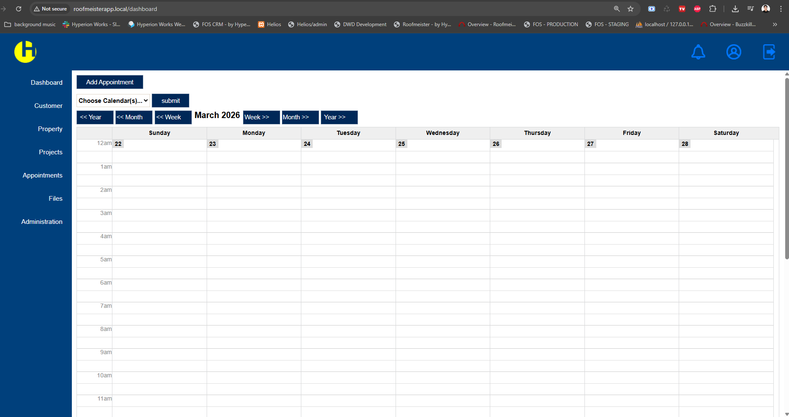
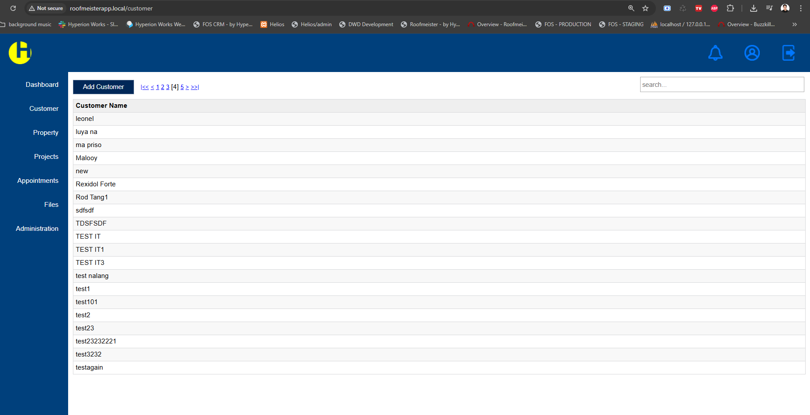
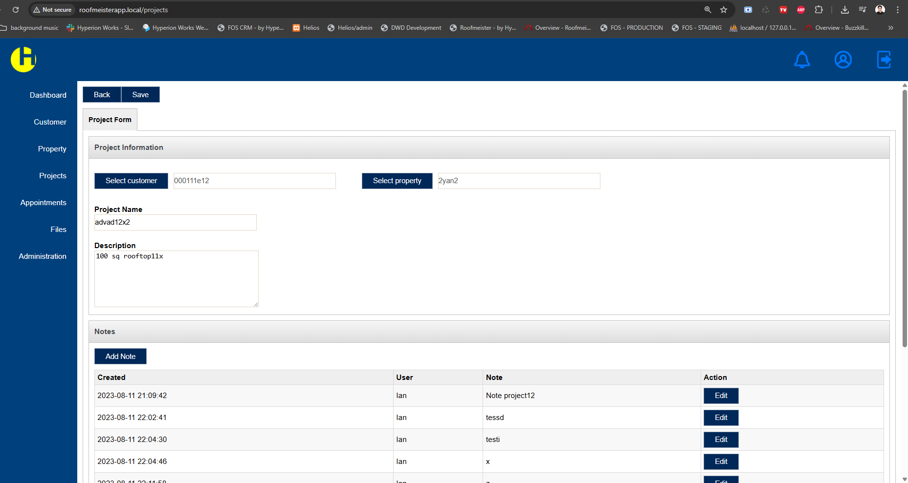
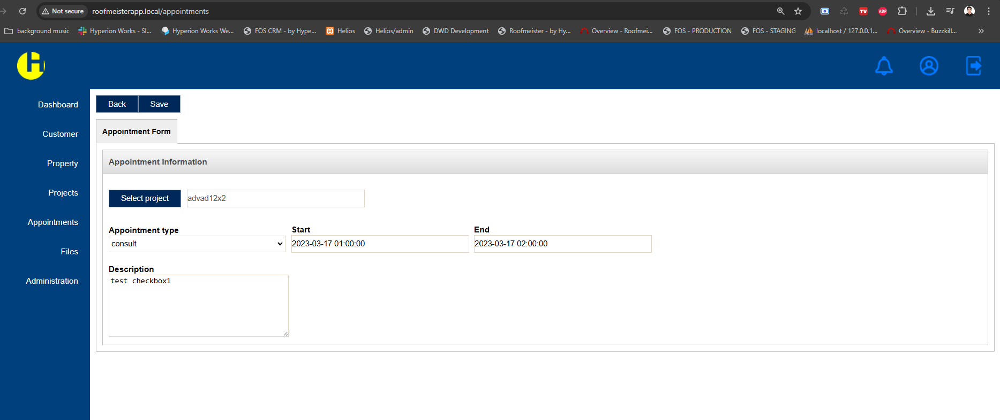

# Roofmeister – Project & Appointment Management System

## Overview
Roofmeister is a web-based business management system designed to manage customers, properties, projects, and appointments. It provides a structured workflow for handling scheduling, file organization, and administrative operations.

Built using PHP, MySQL, and JSON-RPC architecture, the system focuses on modular backend design and real-world business workflows.

---

## Tech Stack
- PHP
- MySQL
- JSON-RPC Architecture
- JavaScript
- HTML/CSS

---

## Project Structure
roofmeister-system/
├── roofmeister-appback   # Backend logic (API, business rules, DB handling)
├── roofmeister-appfront  # Application interface and modules
├── screenshot            # Project screenshots
└── README.md

---

## Core Features

### Customer Management
- Manage customer profiles
- Link customers to properties and projects
- Track notes and activity history

### Property Management
- Store property details and address information
- Manage property contacts
- Assign property types

### Project Management
- Create and manage projects
- Link projects to customers and properties
- Track project descriptions and details

### Appointment & Calendar System
- Schedule appointments with start/end time
- Categorize appointments by type
- Assign users to appointments
- Manage multiple calendars

### File Management
- Upload and manage files
- Organize files using folder hierarchy
- Control access using groups and permissions

### Notes System
- Attach notes to customers, properties, and projects
- Maintain activity logs and history

### Security & Access Control
- User management system
- Group-based access control (RBAC)
- Security permissions per group

---

## System Workflow
1. Setup users and permissions
2. Add customers and properties
3. Create projects
4. Schedule appointments
5. Manage files and notes
6. Track operations through the system

---

## Screenshots

### Dashboard (Calendar View)

### Customer Management

### Project Management

### Appointment Scheduling

---

## Highlights
- Modular backend architecture
- Relational database design
- Calendar-based scheduling system
- Role-based access control (RBAC)
- Real-world business workflow implementation

---

## Note
This repository contains a simplified and sanitized version of a production system. Sensitive data and credentials have been removed.

---

## Author
Ian M. Juario
